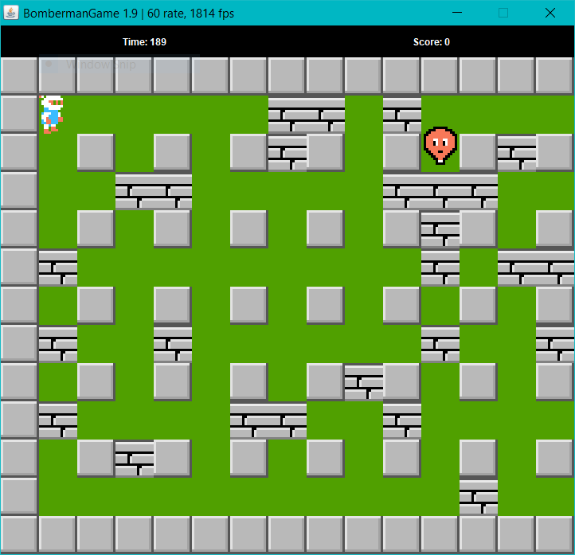

# Bài tập lớn OOP - Bomberman Game

Trong bài tập lớn này, nhiệm vụ của bạn là viết một phiên bản Java mô phỏng lại trò chơi [Bomberman](https://www.youtube.com/watch?v=mKIOVwqgSXM) kinh điển của NES.

Bạn có thể sử dụng mã nguồn tại repository này để phát triển hoặc tự phát triển từ đầu.

## Mô tả về các đối tượng trong trò chơi
Nếu bạn đã từng chơi Bomberman, bạn sẽ cảm thấy quen thuộc với những đối tượng này. Chúng được được chia làm hai loại chính là nhóm đối tượng động (*Bomber*, *Enemy*, *Bomb*) và nhóm đối tượng tĩnh (*Grass*, *Wall*, *Brick*, *Door*, *Item*).

*Hãy thiết kế hệ thống các đối tượng một cách phù hợp để tận dụng tối đa sức mạnh của OOP: tái sử dụng code, dễ dàng maintain.*

-  *Bomber* là nhân vật chính của trò chơi. Bomber có thể di chuyển theo 4 hướng trái/phải/lên/xuống theo sự điều khiển của người chơi. 
-  *Enemy* là các đối tượng mà Bomber phải tiêu diệt hết để có thể qua Level. Enemy có thể di chuyển ngẫu nhiên hoặc tự đuổi theo Bomber tùy theo loại Enemy. Các loại Enemy sẽ được mô tả cụ thể ở phần dưới.
-  *Bomb* là đối tượng mà Bomber sẽ đặt và kích hoạt tại các ô Grass. Khi đã được kích hoạt, Bomber và Enemy không thể di chuyển vào vị trí Bomb. Tuy nhiên ngay khi Bomber vừa đặt và kích hoạt Bomb tại ví trí của mình, Bomber có một lần được đi từ vị trí đặt Bomb ra vị trí bên cạnh. Sau khi kích hoạt 2s, Bomb sẽ tự nổ, các đối tượng *Flame*  được tạo ra.

-  *Grass* là đối tượng mà Bomber và Enemy có thể di chuyển xuyên qua, và cho phép đặt Bomb lên vị trí của nó
-  *Wall* là đối tượng cố định, không thể phá hủy bằng Bomb cũng như không thể đặt Bomb lên được, Bomber và Enemy không thể di chuyển vào đối tượng này
-  *Brick* là đối tượng được đặt lên các ô Grass, không cho phép đặt Bomb lên nhưng có thể bị phá hủy bởi Bomb được đặt gần đó. Bomber và Enemy thông thường không thể di chuyển vào vị trí Brick khi nó chưa bị phá hủy.

-  *Portal* là đối tượng được giấu phía sau một đối tượng Brick. Khi Brick đó bị phá hủy, Portal sẽ hiện ra và nếu tất cả Enemy đã bị tiêu diệt thì người chơi có thể qua Level khác bằng cách di chuyển vào vị trí của Portal.

Các *Item* cũng được giấu phía sau Brick và chỉ hiện ra khi Brick bị phá hủy. Bomber có thể sử dụng Item bằng cách di chuyển vào vị trí của Item. Thông tin về chức năng của các Item được liệt kê như dưới đây:
-  *SpeedItem* Khi sử dụng Item này, Bomber sẽ được tăng vận tốc di chuyển thêm một giá trị thích hợp
-  *FlameItem* Item này giúp tăng phạm vi ảnh hưởng của Bomb khi nổ (độ dài các Flame lớn hơn)
-  *BombItem* Thông thường, nếu không có đối tượng Bomb nào đang trong trạng thái kích hoạt, Bomber sẽ được đặt và kích hoạt duy nhất một đối tượng Bomb. Item này giúp tăng số lượng Bomb có thể đặt thêm một.

Có nhiều loại Enemy trong Bomberman, tuy nhiên trong phiên bản này chỉ yêu cầu cài đặt hai loại Enemy dưới đây (nếu cài đặt thêm các loại khác sẽ được cộng thêm điểm):
-  *Balloom* là Enemy đơn giản nhất, di chuyển ngẫu nhiên với vận tốc cố định
-  *Oneal* có tốc độ di chuyển thay đổi, lúc nhanh, lúc chậm và di chuyển "thông minh" hơn so với Balloom (biết đuổi theo Bomber)

## Mô tả game play, xử lý va chạm và xử lý bom nổ
- Trong một màn chơi, Bomber sẽ được người chơi di chuyển, đặt và kích hoạt Bomb với mục tiêu chính là tiêu diệt tất cả Enemy và tìm ra vị trí Portal để có thể qua màn mới
- Bomber sẽ bị giết khi va chạm với Enemy hoặc thuộc phạm vi Bomb nổ. Lúc đấy trò chơi kết thúc.
- Enemy bị tiêu diệt khi thuộc phạm vi Bomb nổ
- Một đối tượng thuộc phạm vi Bomb nổ có nghĩa là đối tượng đó va chạm với một trong các tia lửa được tạo ra tại thời điểm một đối tượng Bomb nổ.

- Khi Bomb nổ, một Flame trung tâm tại vị trí Bomb nổ và bốn Flame tại bốn vị trí ô đơn vị xung quanh vị trí của Bomb xuất hiện theo bốn hướng trên/dưới/trái/phải. Độ dài bốn Flame xung quanh mặc định là 1 đơn vị, được tăng lên khi Bomber sử dụng các FlameItem.
- Khi các Flame xuất hiện, nếu có một đối tượng thuộc loại Brick/Wall nằm trên vị trí một trong các Flame thì độ dài Flame đó sẽ được giảm đi để sao cho Flame chỉ xuất hiện đến vị trí đối tượng Brick/Wall theo hướng xuất hiện. Lúc đó chỉ có đối tượng Brick/Wall bị ảnh hưởng bởi Flame, các đối tượng tiếp theo không bị ảnh hưởng. Còn nếu vật cản Flame là một đối tượng Bomb khác thì đối tượng Bomb đó cũng sẽ nổ ngay lập tức.

## Mô tả starter project
Xem comment ở starter project

## Yêu cầu chung
- Có thể chơi được ít nhất cho một màn chơi (chiến thắng một màn chơi)
- Có thể thay đổi được tệp cấu hình khác cho màn chơi (tương tự mẫu cho trước)

## Nhiệm vụ của bạn
- Gói bắt buộc (+8đ)
1. Thiết kế cây thừa kế cho các đối tượng game +2đ
2. Xây dựng bản đồ màn chơi từ tệp cấu hình (có mẫu tệp cấu hình, xem [tại đây](https://raw.githubusercontent.com/bqcuong/bomberman-starter/starter-2/res/levels/Level1.txt)) +1đ
3. Di chuyển Bomber theo sự điều khiển từ người chơi +1đ
4. Tự động di chuyển các Enemy +1đ
5. Xử lý va chạm cho các đối tượng Bomber, Enemy, Wall, Brick, Bomb +1đ
6. Xử lý bom nổ +1đ
7. Xử lý khi Bomber sử dụng các Item và khi đi vào vị trí Portal +1đ

- Gói tùy chọn (tối đa +2đ)
1. Nâng cấp thuật toán tìm đường cho Enemy +0.5đ
   Cài đặt thêm các loại Enemy khác: +0.25đ cho mỗi loại enemy
2. Cài đặt thuật toán AI cho Bomber (tự chơi) +1đ
3. Xử lý hiệu ứng âm thanh (thêm music & sound effects) +1đ
4. Phát triển hệ thống server-client để nhiều người có thể cùng chơi qua mạng LAN hoặc Internet +1đ
5. Những ý tưởng khác sẽ được đánh giá và cộng điểm theo mức tương ứng
